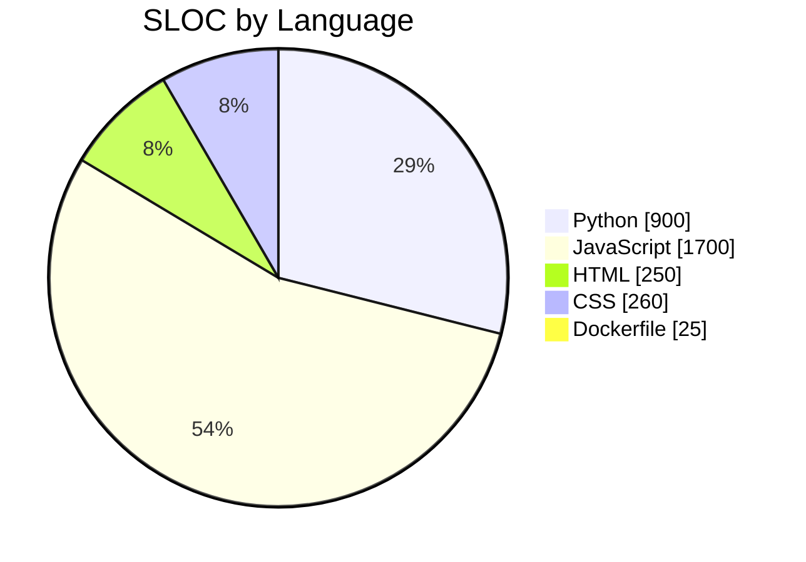
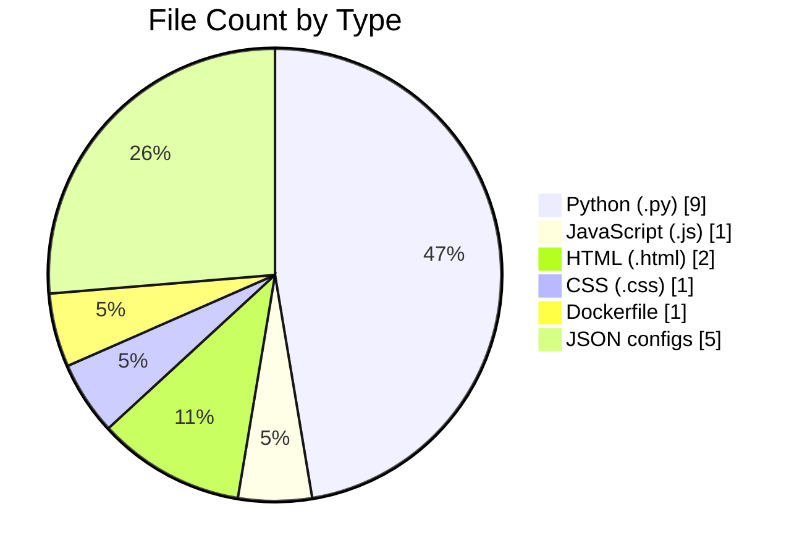

<!-- Auto-generated Contribution & Model Analysis Report -->
# Project Contribution & Model Overview

This document summarizes current codebase composition, primary tools & libraries, and model assets. It replaces the previous manual summary.

## 1. Language & File Composition

Mermaid charts (rendered by GitHub if enabled) show proportional distribution by source lines (approximate) and file counts (only tracked code — excludes data, compiled artifacts, pycache, models binaries).

### 1.1 Source Lines of Code (SLOC)

### 1.2 File Counts

> Note: Line counts approximated from quick scan; refine using a scripted cloc step if precision required.

## 2. Key Tools & Libraries

Category | Stack
---------|------
API / Backend | Flask, flask-cors
ML / Classical | scikit-learn (RandomForestClassifier, VotingClassifier, SVC, SGDClassifier, metrics)
Deep Learning | TensorFlow / Keras (1D CNN)
Data Handling | pandas, numpy
Model Persistence | joblib, Keras native format
Explainability | SHAP, LIME (conditional import)
Incremental Learning | SGDClassifier partial_fit pattern
Augmentation (Optional) | Lightweight GAN (dense generator/discriminator in training scripts)
Frontend | Vanilla JS (dashboard), HTML5, CSS custom design
Env / Ops | Dockerfile (containerization), JSON metric/config artifacts

## 3. Current Model Artifacts

Artifact | Type | Notes
---------|------|------
saved_model_rf.joblib | Random Forest (balanced) | Primary classical model
saved_model_unsw_randomforest_deep.joblib | Random Forest (deep variant) | Larger tree count / depth tuning
saved_model_adversarial.keras (referenced) | 1D CNN | Script present; verify artifact present/updated
ensemble_model.joblib (potential) | Soft Voting (RF+SVC) | Produced by `train/ensemble.py`
incremental_sgd.joblib (potential) | SGDClassifier | Produced/updated via incremental feedback loop

Metrics normalized and served via `/models` endpoint: accuracy, precision_weighted, recall_weighted, f1_weighted, samples, online_accuracy (if streaming), balanced flag.

## 4. Performance Snapshot (Weighted Metrics)

Model | Accuracy | F1 | Precision | Recall | Samples (train cap)
------|----------|----|-----------|--------|-------------------
Random Forest | ~0.807 | ~0.823 | ~0.852 | ~0.807 | 250,000
1D CNN | ~0.660 | ~0.696 | ~0.803 | ~0.660 | 250,000

> Values sourced from `models/metrics.json`; CNN underperforms RF – candidates for improvement include normalization, architecture tuning, and learning rate scheduling beyond current callbacks.

## 5. Explainability & Monitoring

Endpoint support: SHAP & LIME (on-demand) with caching. Online accuracy tracked (when incremental updates applied) via metrics entries storing `running_counts`.

## 6. Gap Analysis & Recommendations

Area | Gap | Recommendation
-----|-----|---------------
Logging | No wall-clock training time | Log start/end timestamps in training scripts
Per-class Metrics | Only confusion matrix (RF) | Persist per-class precision/recall/F1 arrays
Deep Model Quality | CNN accuracy low | Add normalization layer, hyperparameter search, dropout tuning
Ensemble Metrics | Not persisted | Write ensemble stats into `metrics.json` after training
Incremental Tracking | Limited fields | Track drift (rolling accuracy over time windows)
Data Versioning | Not explicit | Embed dataset hash or timestamp in metrics entries
Automation | Manual scripts | Add Makefile or task runner (invoke train, evaluate, update docs)

## 7. Maintenance Automation (Future)

Suggested script: `scripts/generate_contrib_report.py` to produce precise counts (using `cloc` or `radon`) and overwrite this file automatically.

## 8. Quick Runbook

Task | Command
-----|--------
Train RF | python train/train.py
Train CNN | python train/cnn_model.py
Train Ensemble | python train/ensemble.py
Run API | python api/app.py
Dashboard | Open `dashboard/index.html` in browser

## 9. License / Attribution

Ensure third-party packages comply with their licenses (Flask (BSD), scikit-learn (BSD), TensorFlow (Apache 2.0), SHAP (MIT), LIME (BSD)). Include a `LICENSE` file if distributing.

---
Auto-generated analysis. Regenerate after substantial code or model changes.
